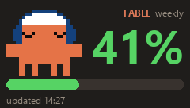

# rt82-fable-usage

Puts Claude Code's Fable usage on the LCD of an Epomaker RT82, refreshed by a
Claude Code `Stop` hook.



The panel shows the Fable weekly percentage, a colour-coded gauge, the time
the frame was rendered, and an animated pixel-art Clawd in headphones whose
face tracks the number:
happy under 70%, worried to 90%, alarmed above, asleep when usage is unknown.
The clock is deliberate: in 2.4GHz mode the screen holds its last frame, so
the stamp says how stale the number is.

## Why this exists as its own implementation

[`guysoft/rt82display`](https://github.com/guysoft/rt82display) did the original
reverse engineering and deserves the credit for the protocol. It could not be
used here:

- `rt82display/__init__.py` imports `.cli`, which does `import fcntl` at module
  scope. The package is unimportable on Windows, and the CLI dies instantly.
- Its activation packets use the wrong report framing on Windows (see below).
- It sends a packet the official tool never sends, which makes the device
  reject every transfer.
- Its bundled pure-Python encoder implements a format the hardware does not use.

## Findings

Everything here was verified against a WebHID capture of the official tool
(`captures/webhid-official-tool.txt`, 3,184 reports) taken from the same
keyboard, plus `HidP_GetCaps` measurements.

### Report framing

hidapi treats byte 0 of every write as the report number. Upstream writes a bare
buffer whose first byte is `0xAA`, so Windows sees a request for report `0xAA` on
an interface that only has report 0, and the keyboard silently ignores it. The
correct framing is `[0x00] + payload` padded to `OutputReportByteLength - 1`,
read from Windows rather than assumed:

| interface | usage page | `OutputReportByteLength` | payload |
|---|---|---|---|
| keyboard `36B0:30A3` if=1 | `0xFF60` | 33 | 32 |
| LCD `1919:1919` if=1 | `0x00FF` | 65 | 64 |

The LCD also exposes a mouse collection (`0x0001/0x02`) at if=0. Windows owns
mouse and keyboard collections exclusively, so opening that one fails — always
select the vendor interface.

### The phantom `AA E3`

Upstream sends `AA E3` twice, the second on the **LCD** interface. The official
tool sends it once, on the keyboard, after `AA 1B`:

```
LCD  aa 1b 00 00 00 38     prepare
KBD  aa e3 00 00 00 01 00 00 01     getGifCount   <- keyboard only
LCD  aa 14 00 00 00 38     screen prep
```

With the extra LCD `E3`, the device accepts the whole control prologue and then
rejects the first `AA 19` data packet, every time.

### `AA 17` is a clock, not a config

Upstream treats it as a static "config" blob and sends a hardcoded constant,
which is just a stale timestamp from its own capture. It carries the current
wall clock, and the official tool sends it twice — once before the transfer and
again in the trailer. Layout after the 8-byte header: year(4) month(2)
weekday(1) day(2) hour(2) minute(2) second(2), one digit per byte. The capture
shows `weekday=2` on a Tuesday, matching `isoweekday()` with Sunday wrapped to 0.

### QGIF is DXT1, not RLE

`QGIF.md` upstream describes a PackBits RLE format. The hardware does not use it.
Real frames are **DXT1/BC1 block compression** — 8 bytes per 4×4 block, two
RGB565 colours plus four bytes of 2-bit indices:

```
240 × 136 ÷ 16 blocks × 8 bytes = 16,320 + header = 16,840 bytes, always
```

A solid red frame encodes as `45 d9 00 00 00 00 00 00` repeated: `0xD945` is
RGB565 for `(220,40,40)`, second colour black, all indices zero. The fixed output
size is the format working correctly, not a broken encoder.

File layout, confirmed by decoding our own output and matching it against the
official tool's 39-frame capture:

```
QGIF  u16be (2*fps - 1)  u16be frame_count  3b 21      10-byte header
then per frame:
  255-byte bitmap, one bit per 4x4 block (2040 blocks = 60 x 34)
  8 bytes per block whose bit is set, row-major
finally one more bitmap+blocks: the delta from the last frame back to the first
```

The first frame's bitmap is all `0xFF` (every block), so a single frame is
10 + 255 + 16,320 + 255 = 16,840 bytes. Later frames carry only the blocks that
changed, which is why the official tool's 39 frames fit in 176,050 bytes and
why animating the mascot costs ~1.2 KB per frame instead of 16 KB.

Because every 4×4 block holds only two colours plus two interpolants, the
mascot is drawn on a 4px grid at a 4px-aligned origin: each sprite cell is
exactly one block, so it comes through pixel-perfect. Anti-aliased text does
not get that treatment and looks slightly soft, which is fine at this size.

The prebuilt `test_qgif.exe` in the rt82display wheel produces this correctly and
runs fine on Windows. The pure-Python `qgif.py` in the same package produces the
documented-but-fictional RLE format, which the screen will not display.

### Other corrections

- The "~64KB firmware buffer" is wrong. The official tool pushed **176,050
  bytes** without complaint.
- Handshake count is **7** `AA E0`, not 5.
- A failed transfer leaves `1919:1919` attached and the keyboard wedged in
  download mode. Only a physical replug clears it, so `upload.preflight()`
  refuses to start against that state rather than burning the attempt.
- Flow control is not optional: without reading a reply after each write the
  device's endpoint buffer fills and writes start failing mid-transfer. Upstream
  uses a 500 ms timeout, which makes a 16 KB push take **451 seconds**. 10 ms
  gives the same pacing in **2.5 seconds**.

## Hard limitation: wired only

The LCD is a separate USB device that the keyboard attaches to the bus only
after the handshake. A 2.4 GHz dongle cannot produce a second USB device, and
the RT82's underside slide switch makes wired and wireless mutually exclusive —
middle position is wired. On 2.4 GHz the screen simply holds its last image,
which is why the panel renders a timestamp.

## Install

```powershell
cd $env:USERPROFILE\.claude
mkdir rt82; cd rt82
python -m venv venv
venv\Scripts\pip install hidapi Pillow rt82display   # rt82display only for its encoder binary
copy <repo>\*.py .
copy <repo>\hooks\rt82-usage.mjs ..\hooks\
```

Register the hook in `~/.claude/settings.json`:

```json
"Stop": [
  { "hooks": [ { "type": "command",
      "command": "node C:/Users/<you>/.claude/hooks/rt82-usage.mjs",
      "timeout": 5 } ] }
]
```

The hook spawns `push.py` detached via `pythonw.exe` and returns in ~0.2s, so it
never blocks the prompt and never flashes a console window.

## Usage

```
python render.py            # render preview.png only, no device access
python render.py --pct 95   # preview a specific percentage / mood (--pct none = asleep)
python push.py              # honour both gates (this is what the hook runs)
python push.py --force      # push regardless
python push.py --verbose    # log why it skipped
python replay.py <capture>  # replay a WebHID capture verbatim
python parse_capture.py <capture>   # decode a capture, reassemble its QGIF
```

`push.py` writes nothing unless an hour has passed **and** the content
signature changed. The signature is the rounded percentage only — deliberately
not the pixels, since the rendered clock ticks every minute and would make
every render unique. The mascot's mood is a function of the percentage, so it
needs no separate key.

Each push erases and rewrites keyboard flash, hence the gates.

## Data sources

- **Gauge**: the cache `~/.claude/statusline.mjs` already maintains at
  `%TEMP%/cc-statusline-usage.json`. Only that script talks to the usage API; if
  the cache is older than 10 minutes this shells out to its existing
  `--fetch-usage` flag.
- **Mascot**: `mascot.py`. A 24×21-cell body traced from the rest pose of a
  Clawd-with-headphones animation, plus four face overlays, one per mood. The
  body is split into parts (head, torso, arms, legs) and a 6-frame loop at
  5 fps moves them by whole cells: a hop each way and a wave with each arm.
  The keyboard loops the frames itself, so animation costs no USB traffic
  after the push.

## Licensing

The protocol knowledge here derives from `guysoft/rt82display`, which is
**GPLv3**. The code is an independent implementation, but if this is ever
published, that lineage needs deciding on deliberately. No licence is declared
yet.
